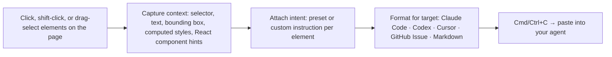

# Point2Prompt

**Point at your UI. Paste a perfect prompt.**

Point2Prompt is a bookmarklet for AI-assisted frontend work. Click real elements on any webpage, attach what you want changed, and copy a structured brief for Claude Code, Codex, Cursor, or a GitHub issue. No extension, no backend, no account.

**[Install from the live page →](https://lobsterqba.github.io/point2prompt/)** · [Roadmap](ROADMAP.md)

## Why this exists

Describing a UI change to a coding agent is still clumsy. You take a screenshot, draw an arrow, and type "the small text under the second card on the right." Then the agent guesses which component, selector, style, or copy block you meant.

Humans are good at seeing what feels wrong. Agents are good at changing files. Point2Prompt is the pointing layer between them.

## How it works



Everything runs client-side inside the page you are already looking at. No page content leaves the browser.

## Install

1. Open the [install page](https://lobsterqba.github.io/point2prompt/).
2. Drag the **Point2Prompt** button to your bookmarks bar.
3. Open any webpage and click the bookmark.

The bookmarklet injects `assets/editor.css` and `assets/editor.js` into the current page.

## Usage

| Action | Result |
| --- | --- |
| Click | Select one element |
| Shift-click | Add an element to the selection |
| Drag | Select elements inside a region |
| Up / Down | Move to parent / first visible child |
| Left / Right | Move to previous / next sibling |
| Cmd/Ctrl + C | Copy the generated prompt |
| Esc | Clear the current selection |

**Intent presets:** rewrite copy · adjust spacing · improve visual hierarchy · fix responsive layout · improve contrast · match nearby style · polish interaction state · custom instruction.

**Output formats:** Claude Code, Codex, Cursor, GitHub Issue, Markdown.

To try it without a real project, open [`demo.html`](demo.html), a deliberately messy sample site built for testing selection, multi-select, and prompt copying.

## Example output

```text
UI change brief generated by Point2Prompt

Task: Update the selected UI elements using the element context below.

Page: http://localhost:3000/dashboard
Viewport: 1440x900
Output target: Codex

Selected elements:

1. h1.hero-title
   selector: body > main:nth-of-type(1) > section.hero:nth-of-type(1) > h1.hero-title:nth-of-type(1)
   rect: x=112, y=164, w=620, h=96
   text: "Welcome back to your workspace"
   intent: Improve visual hierarchy
   instruction: Make this headline sharper and less generic.
   react: App > DashboardPage > Hero
   styles: font=..., size=64px, color=rgb(...), background=rgba(...), display=block
   html: <h1 class="hero-title">Welcome back to your workspace</h1>

Please make the smallest code change that satisfies the instructions.
Preserve nearby behavior and visual intent unless the instruction says otherwise.
```

## Development

The project is intentionally static.

```bash
python3 -m http.server 8080
```

Open `http://localhost:8080`.

- `index.html` — install page
- `assets/editor.js` — bookmarklet behavior
- `assets/editor.css` — injected UI styling
- `demo.html` — sample site for testing

GitHub Pages deploys from `main` via [`.github/workflows/pages.yml`](.github/workflows/pages.yml).

## Privacy

Point2Prompt does not send page content anywhere. The generated prompt is copied to your clipboard from inside the browser.

## License

MIT
